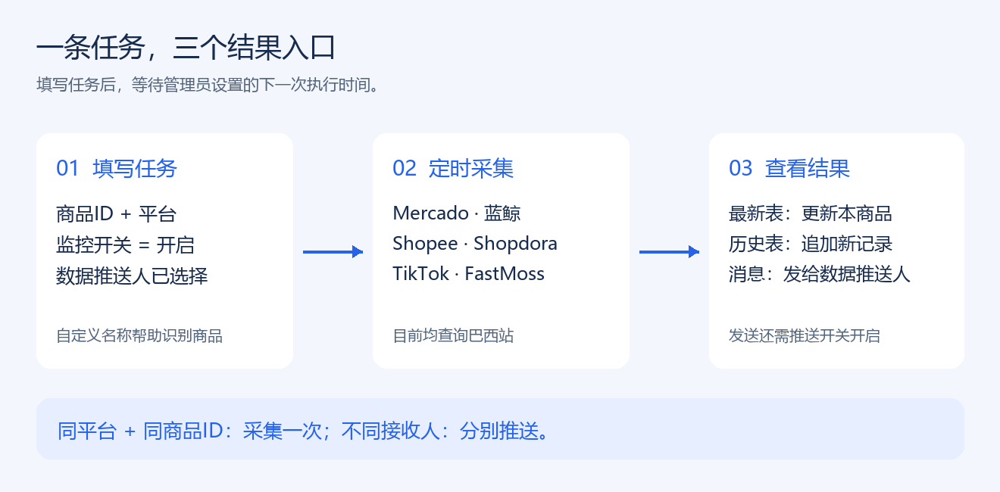
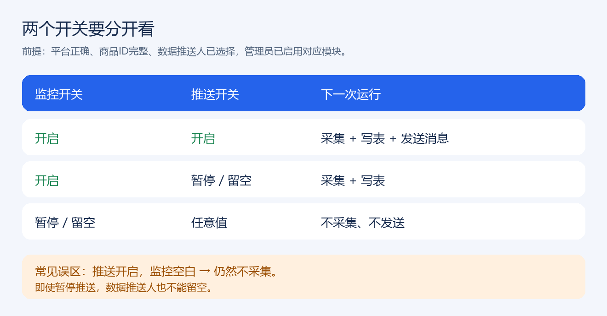
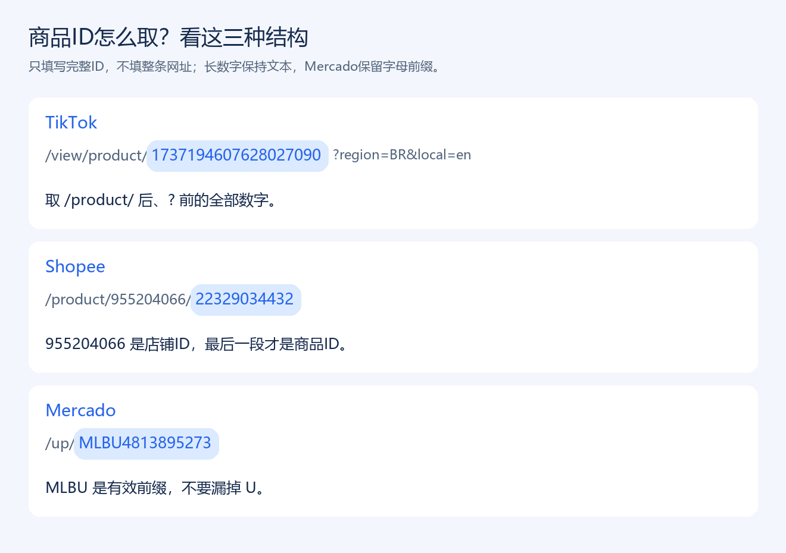

# 商品监控控制台 · 新手使用指南

适用平台：Mercado（美客多）、Shopee（虾皮）、TikTok。当前采集站点为巴西。本文按当前项目行为编写，更新于 2026-10-06。

你只需在任务表填写商品和人员，运行中的监控程序会按管理员设置的时间采集，并更新最新数据、追加历史记录、发送飞书卡片。**保存任务不代表立即开始采集；电脑上的程序必须正在运行。**

[打开任务表](https://qcn9sleukmer.feishu.cn/base/Jpd2bH2CtarZ3UsR0OBcBSxjnng?table=tblIGBjHB1XgNbHv&view=vewvhu2V6C)

## 1. 第一次使用：先完成这一条任务

1. 打开上方任务表，进入左侧「控制台」，在对应平台分组中新增一条记录。
2. 填写完整的 **商品ID**，只填 ID，不填整条网址。取 ID 的方法见第 3 节。
3. 选择 **平台**：`mercado`、`shopee` 或 `tiktok`。确认平台与商品链接一致。
4. 将 **监控开关** 设为「开启」。需要消息时，将 **推送开关** 也设为「开启」。
5. 在 **数据推送人** 中选择飞书人员；可以选择多人。必须从人员字段中选择，不能只在备注里输入姓名。
6. 建议填写「自定义-商品名」「是否竞品」「负责人」，方便识别和管理商品。
7. 等待表格保存，再等待下一次采集。采集完成后，通过结果链接查看数据，接收人可在飞书机器人会话中查看消息。

**进入采集必须同时满足：平台已支持、商品ID不为空、监控开关为「开启」、数据推送人不为空。**

例如，新增一条 TikTok 任务：

| 字段 | 示例填写 |
| --- | --- |
| 商品ID | `1737194607628027090` |
| 自定义-商品名 | 雨伞主推款（示例昵称，可自行修改） |
| 平台 | `tiktok` |
| 监控开关 | 开启 |
| 推送开关 | 开启 |
| 是否竞品 | 否 |
| 数据推送人 | 选择需要收到卡片的运营同事 |
| 负责人 | 选择管理该商品的人员 |
| 备注 | 可填写跟进事项；不影响采集 |

## 2. 任务表每个字段怎么填

| 字段 | 用途与填写方式 | 是否影响采集 |
| --- | --- | --- |
| 商品ID | 商品的唯一标识。完整复制，保留字母前缀和全部数字 | 必填 |
| 自定义-商品名 | 自己起的短名称，如「主推雨伞」「竞品A」。显示在结果和消息中，不替代平台原标题 | 不影响 |
| 平台 | 选择 `mercado`、`shopee` 或 `tiktok`；同一 ID 在不同平台视为不同商品 | 必填 |
| 监控开关 | 「开启」才采集；暂停或留空都不采集 | 必须开启 |
| 推送开关 | 「开启」才发送消息；暂停或留空时仍可采集并写表 | 只影响消息 |
| 是否竞品 | 「是」表示竞品，「否」表示非竞品。用作结果标记，不决定是否采集 | 不影响 |
| 数据推送人 | 飞书消息接收人，可选多人。即使暂停消息推送，也必须填写此字段才能采集 | 必填 |
| 记录-多维表链接 | 对应平台的最新数据入口，可填写第 5 节的链接 | 不影响 |
| 记录-二维表链接 | 对应平台的历史记录入口，可填写第 5 节的链接 | 不影响 |
| 负责人 | 商品管理人员，会写入结果；不会自动成为消息接收人 | 不影响 |
| 备注 | 内部说明、跟进事项 | 不影响 |

### 两个开关的区别

以下情况都以商品ID、平台和数据推送人已正确填写为前提：

| 监控开关 | 推送开关 | 下一次运行的行为 |
| --- | --- | --- |
| 开启 | 开启 | 采集商品，写入两张表，并向数据推送人发送卡片 |
| 开启 | 暂停或留空 | 采集商品并写入两张表，不发送卡片 |
| 暂停或留空 | 任意值 | 不采集该任务，不发送该任务的卡片 |

上述行为还需管理员已启用对应平台及写表、消息模块。任务表开关无法替代程序配置。

**特别注意：例如 Shopee 的「推送开关」为开启，但如果「监控开关」空白，程序仍会跳过。两个开关要分别检查。**

## 3. 从商品链接找到商品ID

### TikTok：取 `/product/` 后面的一整串数字

示例商品链接：

`https://shop.tiktok.com/view/product/1737194607628027090?region=BR&local=en`

应填写的商品ID：**`1737194607628027090`**。

取 `/product/` 后、`?` 前的内容；`region=BR` 和 `local=en` 是网址参数，不属于商品ID。TikTok ID 很长，要作为文本完整保留，不要变成科学计数法，不要只复制末尾几位。

### Shopee：取产品链接中最后一个 ID

结构示例：

`https://shopee.com.br/product/955204066/22329034432`

这里 `955204066` 是店铺ID；应填写的商品ID是 **`22329034432`**。如果链接使用 `…-i.店铺ID.商品ID` 的形式，取最后一段商品ID。

### Mercado：保留商品的完整字母前缀

结构示例：

`https://produto.mercadolivre.com.br/MLB-6984707226-商品名称_JM`

应填写：**`MLB6984707226`**，去掉网址中 `MLB` 与数字之间的连接符。

另一个示例：

`https://www.mercadolivre.com.br/lancheira-marmita-bolsos-laterais/up/MLBU4813895273`

应填写：**`MLBU4813895273`**。`MLBU` 是有效前缀，不要删除 `U` 或改成 `MLB`。

Mercado 的商品页可能同时展示商品ID、目录ID和其他关联ID。若无法判断，应先请管理员核对所需监控的商品；不要把店铺ID当作商品ID。

## 4. 同一商品怎样推送给多个人

最方便的方法是：在同一条任务的「数据推送人」里选择多位人员。

也可以为同一平台、同一商品ID建立多条任务，分别填写接收人。程序会把这些任务合并为一个采集目标：**商品只查询一次，采集结果分别推送给各条已开启推送的任务人员。**

例如，两条 `mercado + MLBU4813895273` 任务分别设置运营A、运营B，且两个开关都开启：本轮只采集这个商品一次，A和B都能收到结果。同一批次、同一商品、同一接收人会去重，避免因重复任务发送重复商品消息。

如果A需要接收、B暂时不需要，可以只暂停B对应任务的「推送开关」。负责人不会替代数据推送人；需要负责人也收到消息时，请在数据推送人中选中负责人。

## 5. 到哪里查看结果

| 平台 | 最新数据：多维表 | 历史数据：二维表 |
| --- | --- | --- |
| Mercado | [商品监控-mercado](https://qcn9sleukmer.feishu.cn/base/BIsSbXFRVazrbNsHIGgcAMU1nlf?table=tblmB2qZd3ZwyOuK&view=vewJ88CiPU) | [mercado历史记录](https://qcn9sleukmer.feishu.cn/sheets/CtJBs6IughsqUrtVAbYcBuXKnSg) |
| Shopee | [商品监控-shopee](https://qcn9sleukmer.feishu.cn/base/Sv8bbLjl9a8FUssWffHckjyInpb?table=tblwgcnRZSOy3T5v&view=vewclZiRO3) | [shopee历史记录](https://qcn9sleukmer.feishu.cn/sheets/CEQKsDr3OhCkJItCeeFcd5Q3n9e?sheet=061d69) |
| TikTok | [商品监控-tiktok](https://qcn9sleukmer.feishu.cn/base/RciEbRT9MaWeA3sMesqcuGswnQ4?table=tblqXfY36xQ2iNP8&view=vewcfc4tJB) | [tiktok历史记录](https://qcn9sleukmer.feishu.cn/sheets/OTfUsgawthKeVLt2Be2crr6EnDf?sheet=ae1e40) |

**最新数据表**：同一商品已有记录时更新该记录；没有记录时才新增。适合查看最近一次采到的价格、销量等。

**历史数据表**：每次新采集追加一条历史，不覆盖之前的记录。适合比较不同时点；同一个采集批次的补写不会重复追加。

**飞书消息**：机器人卡片展示商品ID、自定义名称、平台标题、采集时间和主要指标。同一人员监控的多个商品可能合并在一张卡片中。底部「查看商品」打开商品页，「数据链接」打开最新数据表，「历史链接」打开历史表。

「更新日期／更新时间」是写入表格的时间；「采集时间」是实际获取该批商品数据的时间。补写历史数据时，两者可能不同。空白或 `—` 通常表示未获取到指标，不等于 0；显示 0 才表示获取到了零值。不同平台的统计周期不同，请按字段中的日、月或近7天等周期比较。

## 6. 常见问题：先检查这些位置

| 遇到的问题 | 先检查什么 |
| --- | --- |
| 商品一直没有数据 | 商品ID是否完整、平台是否正确、监控开关是否开启、数据推送人是否为空；再确认程序运行及下一次执行时间 |
| 推送已开启，仍没有采集 | 检查的是「监控开关」还是「推送开关」；只有推送开启不够 |
| 有数据但没有消息 | 推送开关是否开启、数据推送人是否选了正确人员；请管理员检查消息模块与机器人权限 |
| 负责人没有收到消息 | 负责人不是发送目标；把该人员加入「数据推送人」 |
| 最新表更新了，历史表没有增加 | 两个写入模块独立执行；请管理员检查历史表权限、表头和运行报告，不要连续重复新建相同任务 |
| 表里某些指标为空 | 平台可能未提供，或本轮未采完整；不要自行将空白改成 0 |
| 修改任务后没有立即变化 | 任务保存后，等待下一轮；如需马上采集，请管理员手动运行一次 |
| 登录过期／浏览器要求验证码 | 请管理员在项目浏览器里完成登录或验证；任务表内不要填写网站密码 |
| 商品链接与预期商品不同 | 尤其 Mercado 搜索可能采用返回的第一条结果；请管理员核对实际商品链接和任务ID |

需要管理员排查时，请提供：平台、商品ID、期望采集时间、结果表截图以及问题描述。程序的终端和日志包含跳过、采集、写表、发送消息各阶段信息，可以区分失败发生在哪一步。

## 7. 日常维护与管理员说明

运营人员新增或修改任务即可；无需修改代码。暂时停止商品监控时，将「监控开关」暂停；仅不想收消息时，将「推送开关」暂停并保留数据推送人。

管理员应保持电脑和项目进程运行，并确认当前每日执行时间。项目中 `once` 是立即执行一次，`serve` 是常驻定时运行；时间由本地 `config.toml` 的 `schedule.daily_time` 和 `schedule.timezone` 决定，启动是否立即执行由 `run_on_start` 决定。关闭终端或停止电脑会影响常驻采集。

任务表与结果表的应用权限、飞书机器人发送权限、平台登录状态由管理员维护。结果表、历史表、消息分别写入，一项失败可能不影响其他项。账号和密钥放在管理员的本地配置，不写进任务表或使用指南。

图示为教学示意，示例昵称和人员不代表真实商品信息。界面显示名称可能随飞书更新略有变化，以任务表实际字段为准。
